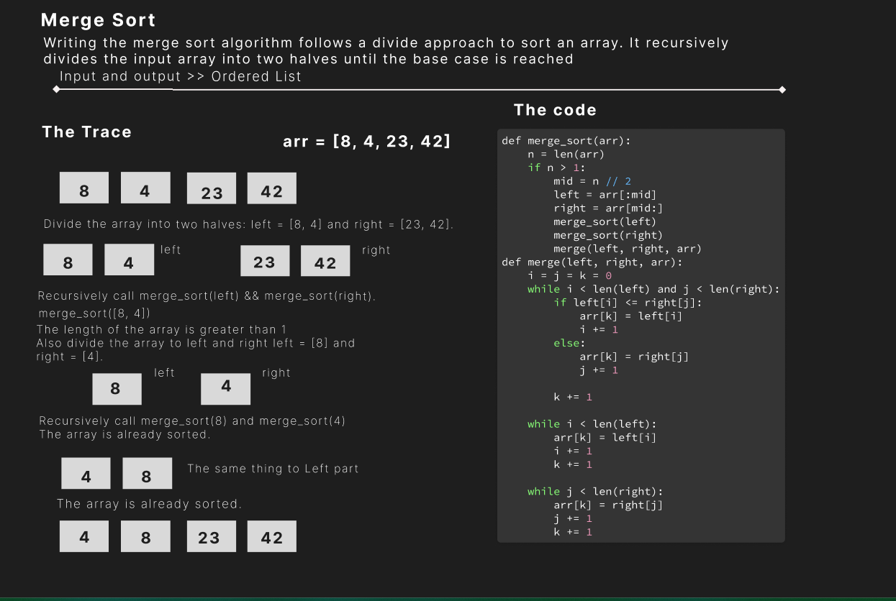

# Challenge Title

## **Code Challenge no.27: Merge Sort**

### Whiteboard Process

### Approach & Efficiency

1. Start with divided the array to left and right side.
2. Call Recursively merge_sort(left) && merge_sort(right).
3. Then do merge_sort(L,R)
4. When the length of the array is greater than 1 go inside
5. To divide the array to left and right left = [8] and right = [4].
6. And Call again do mearge to have the last merge sorted array.</n></n>
Time complexity: O(n^2)
Space Complixity :O(n1)

### Solution

To run the code, you have to pass an array and a value to be inserted:

- Test code: `pytest tests/test_merge_sort.py`
- Run  code: `python3 Merge_Sort.Mergesort.py`
