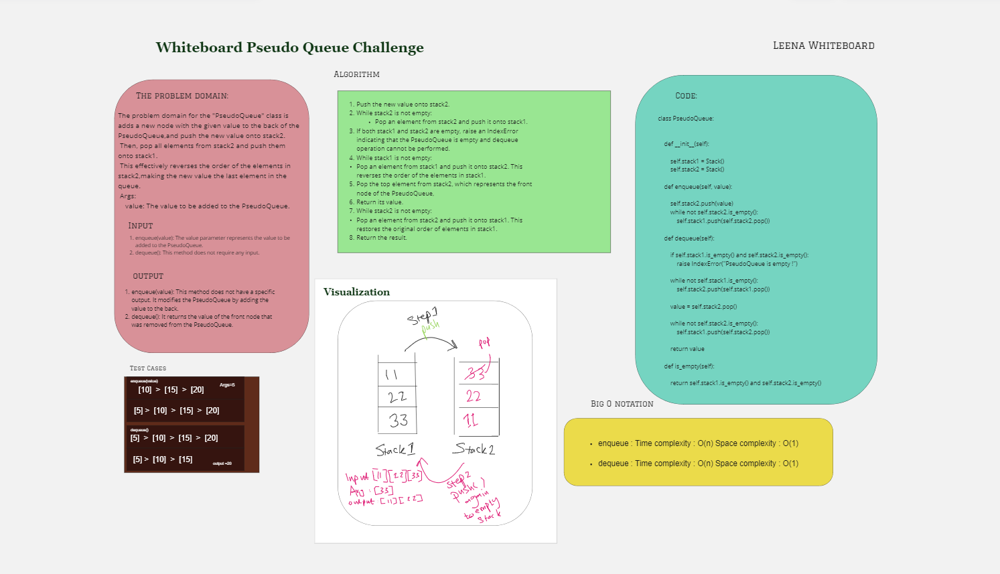

# Challenge Title || Algorithm Pseudo Queue
## Feature Tasks
Create a new class called pseudo queue. Internally, utilize 2 Stack instances to create and manage the queue 
Methods: 
**enqueue Arguments**: value Inserts a value into the PseudoQueue, using a first-in, first-out approach. 
**dequeue Arguments**: none Extracts a value from the PseudoQueue, using a first-in, first-out approach.

## Whiteboard Process

## Approach & Efficiency

Time complexity : The time complexity of enqueue and dequeue methods is O(n), where n is the number of elements in the queue, because in both methods, in the first will move all the elements from one stack to another, which takes O(n) time, and then perform some constant time operations.
Space complexity : The space complexity of enqueue and dequeue methods is O(n), because we are using two stacks to implement the queue, each of which can potentially hold n elements.

## Solution
To run the code from terminal follow these command:

python3 -m venv .venv
source .venv/bin/activate
pip install pytest or pip install -r requirements.txt
pytest
### The Test Code 
[test_pseudoQueue](../tests/test_pseudoQueue.py)
### The Code 
[Pseudo Queue](./PseudoQueue.py)
