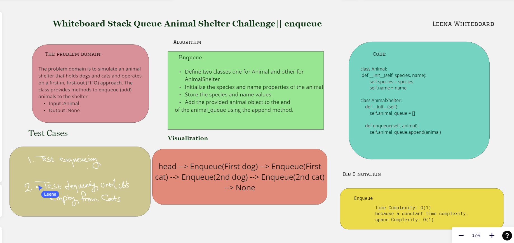
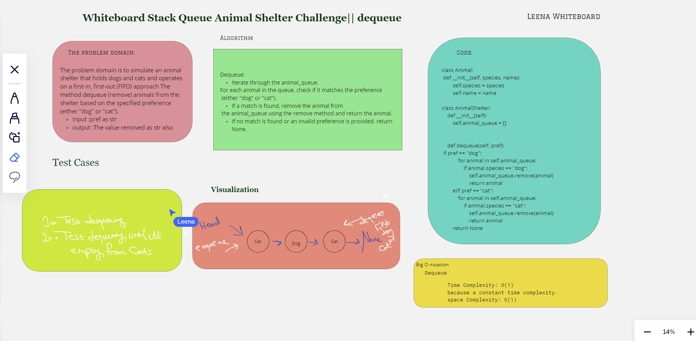

# Challenge Title: Stack Queue Animal Shelter / Algorithm

Create a class called AnimalShelter which holds only dogs and cats,The shelter operates using a first-in, first-out approach.so we have to Implement the following methods:

1. Enqueue

- Arguments: animal

- animal can be either a dog or a cat object.

2. Dequeue

- Arguments: pref

- pref can be either "dog" or "cat"

- Return: either a dog or a cat, based on preference.

- If pref is not "dog" or "cat" then return None.

## Whiteboard Process
- Enqueue

- Dequeue

## Approach & Efficiency

### Big O notation

Enqueue Method => Time O(1) Dequeue Method => Time O(1)

- Enqueue
Arguments: animal
animal can be either a dog or a cat object.
- Dequeue
Arguments: pref
pref can be either "dog" or "cat"
Return: either a dog or a cat, based on preference.
If a cat or dog isn’t preferred, return whichever animal has been waiting in the shelter the longest.

## Solution
Run this command >> python3 StackAndQueue/shelter.py 
[The Code](./shelter.py)

