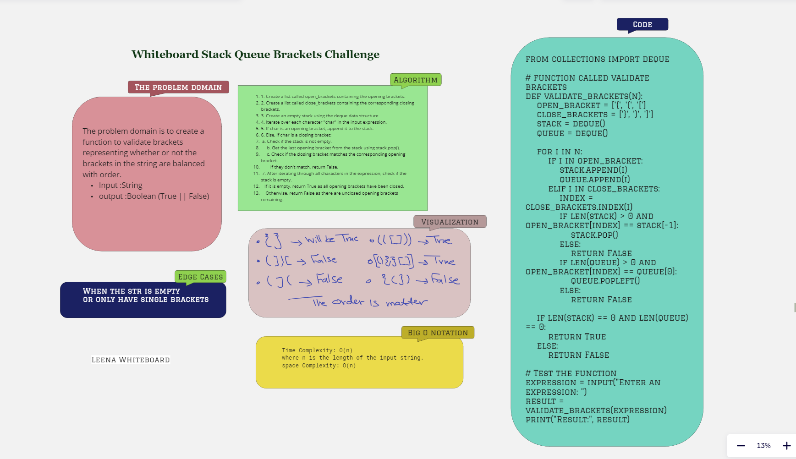

# Challenge Title || Stack Queue Brackets

Determine whether a given string containing various types of brackets (e.g., {}, (), []) has balanced or properly nested brackets

## Whiteboard Process



## Approach & Efficiency

The approach taken in the code is a stack-based approach.
 It iterates over the input string, pushing opening brackets onto a stack, and whenever a closing bracket is encountered, it checks if it matches the corresponding opening bracket at the top of the stack.
 If the brackets are balanced, the stack will be empty at the end.
The Efficiency:
Time Complexity: O(n),where n is the length of the input string.
space Complexity: O(n)

## Solution

### Examples of it in action --> <br>

 ```python
def validate_brackets(n):
    open_bracket = ['{', '(', '[']
    close_brackets = ['}', ')', ']']
    stack = []

    for i in n:
        if i in open_bracket:
            stack.append(i)
        elif i in close_brackets:
            index = close_brackets.index(i)
            if len(stack) > 0 and open_bracket[index] == stack[len(stack)-1]:
                stack.pop()
            else:
                return False

    if len(stack) == 0:
        return True
    else:
        return False
```

### To Run and Test the code
>
> `python3 StackAndQueue/stackqueuebrackets/brackets.py`<br>
> `pytest -s tests/testsBrackets.py` + `Choose Expression:`<br>
