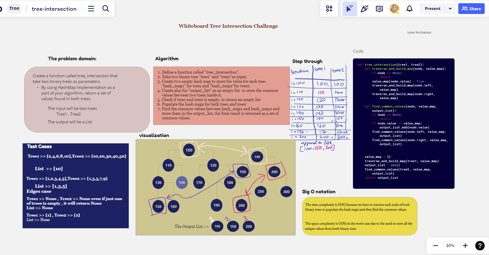

# Challenge Title

## **Code Challenge : Tree intersection**

### Author : LeeNa Alzaben

### The whiteboard

### Approach & Efficiency

Create a method that find the common values between two binary trees

- **Time complexity** of `tree_intersection`: O(n1 + n2), where n1 and n2 are the number of nodes in `tree1` and `tree2` respectively.

- **Space complexity** of `tree_intersection`: O(n1 + min(n1, n2)), where n1 and n2 are the number of nodes in `tree1` and `tree2` respectively.

- **Space complexity** of `traverse_tree`: O(n), where n is the number of nodes in the binary tree being traversed.

### Solution

To run the code:

- Test code: `pytest tests/test_treeIntersection.py`
- Run code : `python3 TreeIntersection/treeIntersection.py` 
[Tree Intersection Code](./treeIntersection.py)
