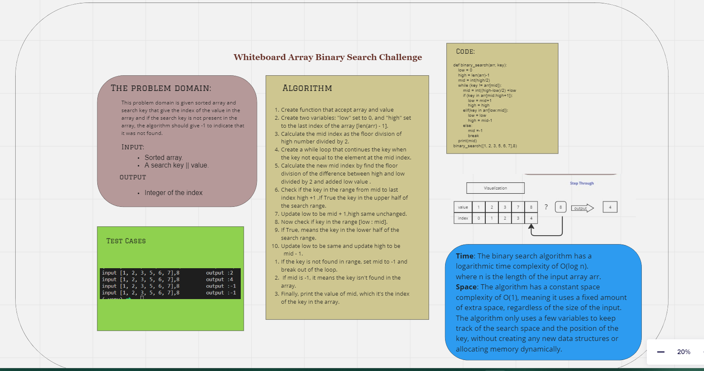

# Code Challenge_03 : Array Binary Search
# Author : 
## Driver : Leena Alzaben & Navigater: Ibrahim Adnan
<br>

Write a function called `Binary_Search` which takes in parameters:<br>
The first to **sorted array** and the second to **search key**.<br>
Whice this algorithm search for a specific element in a sorted array.<br>
And return the index of the array’s element that is equal to the value of the search key, or -1 if the element does not exist in the array.

## Whiteboard Process



## Approach & Efficiency

- Time: It divide the array in half each "while" step.<br>
- Space:The variable we assign do not get effected by the array
O(1)

## Solution

```
def binary_search(arr, key):
    low = 0
    high = len(arr)-1
    mid = int(high/2)
    while (key != arr[mid]):
        mid = int((high-low)/2) +low
        if (key in arr[mid:high+1]):
            low = mid+1
            high = high
        elif(key in arr[low:mid]):
            low = low
            high = mid-1
        else:
            mid =-1
            break
    print(mid)
binary_search([1, 2, 3, 5, 6, 7],8)

```
