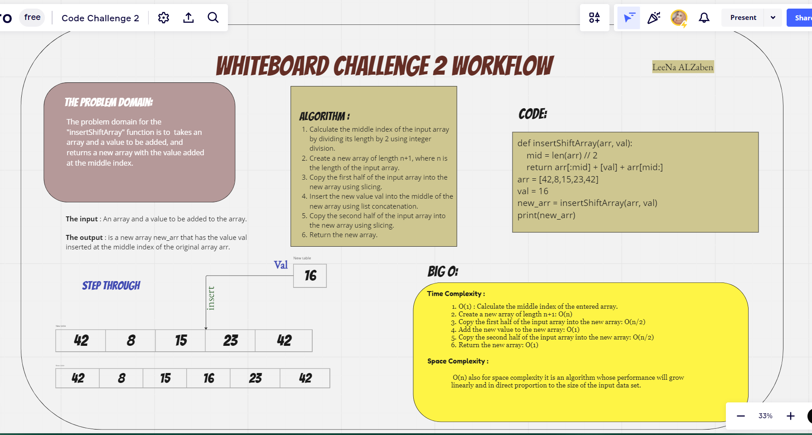

# Challenge Title

## Code Challenge: Class 02_Insert Shift Array


# Whiteboard Process



# Approach & Efficiency

#### What approach did you take? Why?

 I explained that the function takes an array arr and a value val as arguments.and calculates the midpoint of the array using integer division.
 Then, I walked through how the function creates a new array by slicing the first half of the original array.
 Appending the new value, and then adding the second half of the original array to the end.
  Finally, I explained that the result is the new array with the inserted value.

### The Big O space/time for this approach

#### Time Complexity

 1. O(1) : Calculate the middle index of the entered array.
 2. Create a new array of length n+1: O(n)

 3. Copy the first half of the input array into the new array:
  O(n/2)
 4. Add the new value to the new array: O(1)
 5. Copy the second half of the input array into the new array:
 O(n/2)
 6. Return the new array: O(1)

####  Space Complexity

 O(n) also for space complexity it is an algorithm whose performance will grow linearly and in direct proportion to the size of the input data set.

# Solution

```
def insertShiftArray(arr, val):

    mid = len(arr) // 2
    return arr[:mid] + [val] + arr[mid:]
arr = [42,8,15,23,42]
val = 16
new_arr = insertShiftArray(arr, val)
print(new_arr)
```
