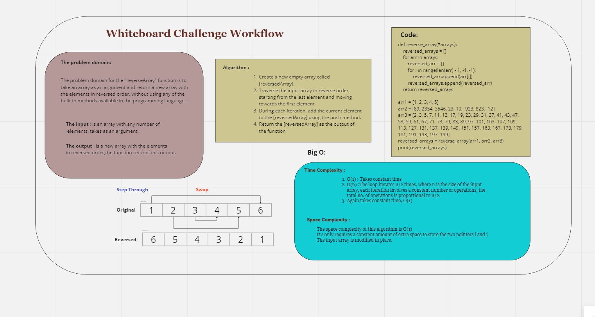

# data-structures-and-algorithms


## Code Challenge: Class 01_ReverseArray

### Reversing an array that changing the order of its elements so that the last element becomes the first,the second-to-last element becomes the second, and so on, until the first element becomes the last.

## Whiteboard Process



## Approach & Efficiency

### The approach taken was to loop through the original array from the last element to the first element and append each element to a new array in reverse order. 

### This approach has a time complexity of O(n), where n is the length of the array, because it requires iterating over every element in the array once.

## Solution

```
def reverse_array(*arrays):
    reversed_arrays = []
    for arr in arrays:
        reversed_arr = []
        for i in range(len(arr) - 1, -1, -1):
            reversed_arr.append(arr[i])
        reversed_arrays.append(reversed_arr)
    return reversed_arrays
    array_n = []
reversed_arrays = reverse_array(array_1, array_2, array_3)
print(reversed_arrays)

```
