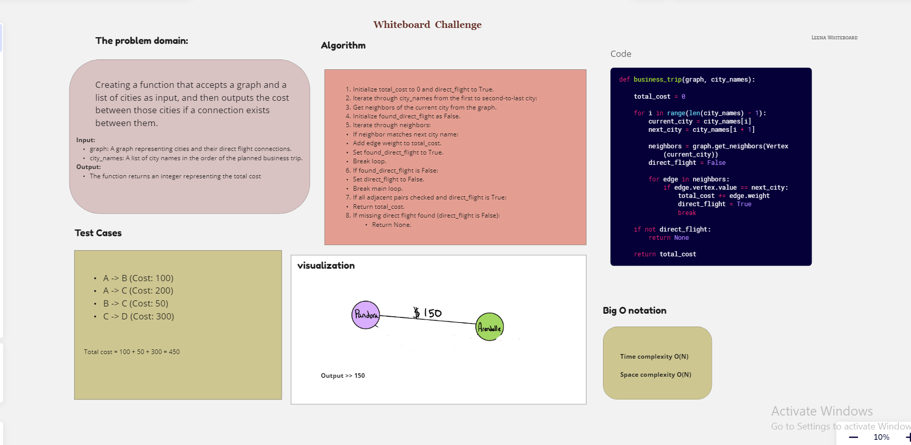

# GraphBusinessTrip

## Creating a function that accepts a graph and a list of cities as input, and then outputs the cost between those cities if a connection exists between them

## Whiteboard Process

## Solution

To run >> `python3 graph/graphBusinessTrip.py`
To test >> `pytest tests/test_graphBusinessTrip.py`
[Code](./graphBusinessTrip.py)