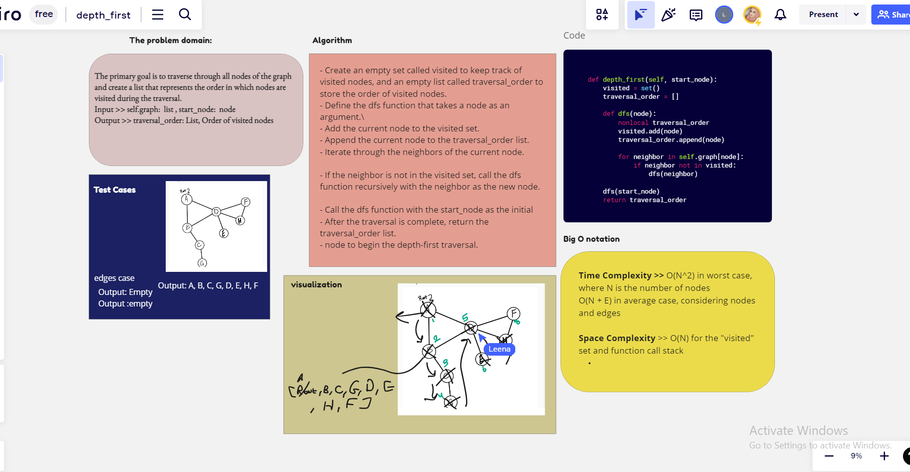

# Challenge Title || Graph Depth first

## **Class Number 38**

### Author : LeeNa Alzaben

### Approach & Efficiency

Conduct a depth first pre-order traversal on a graph

### Solution

### setup

- to test >> `pytest tests/test_garphDepthFirst.py`
- to run >> `python3 graph/graphDepthFiest.py`
