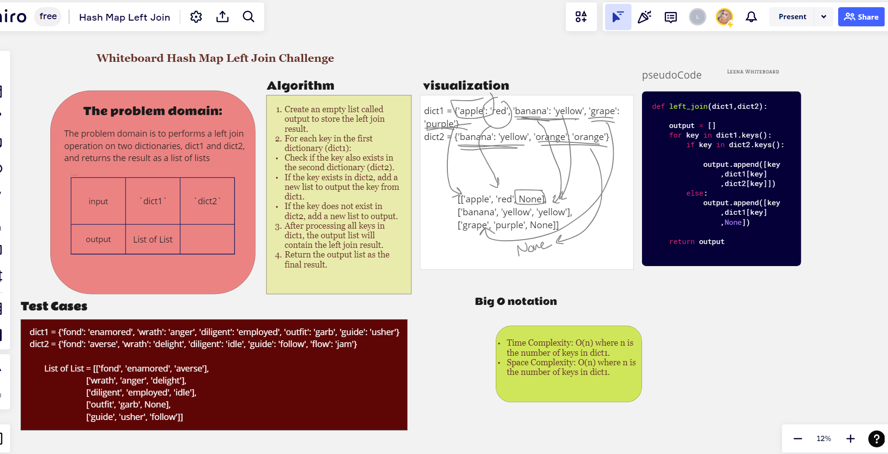

# Challenge Title

## **Code Challenge no.33: Implement a simplified LEFT JOIN for 2 Hashmaps

**

### Author : LeeNa Alzaben

### Approach & Efficiency

 In this problem domain, a "left join" operation combines key-value pairs from two dictionaries based on the keys present in dictionary

**Input:**

| Parameter | Data Type   | Description                                      |
|-----------|-------------|--------------------------------------------------|
| `dict1`   | Dictionary  | The first dictionary to be left-joined.         |
| `dict2`   | Dictionary  | The second dictionary to be left-joined.        |

**Output:**

| Data Type        | Description                                                                                       |
|------------------|---------------------------------------------------------------------------------------------------|
| List of Lists    | The result of the left join operation.

### Solution

1. To test the code >> `pytest test_hashmap_left_join.py` go first inside **tests file**
2. To run the code >> `python3 hashmap_left_join.py` go inside **cd hashmapLeftJoin file**

| Item | File Links                                |
|------|-------------------------------------------|
| 1.   | [Code](./hashmap_left_join.py)            |
| 2.   | [Test](../tests/test_hashmap_left_join.py)|
