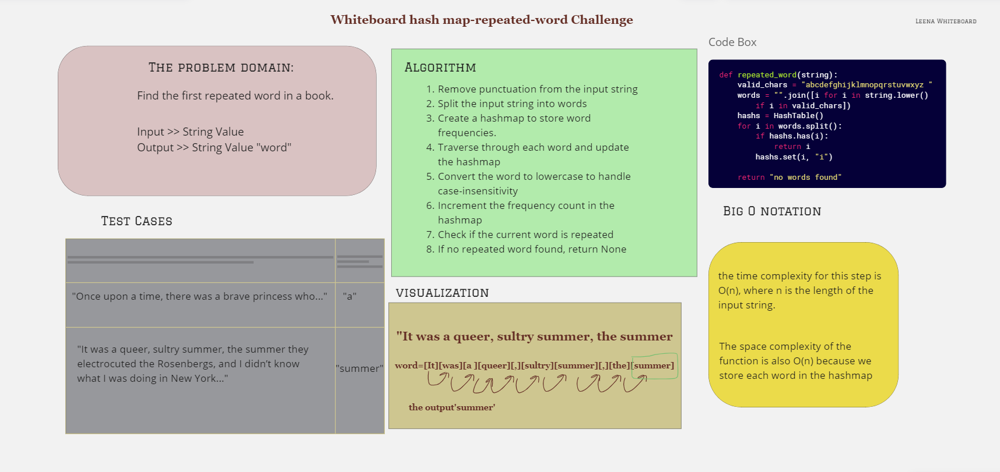

# Challenge Type: Code Challenge / Algorithm

## Code challenge 31 - Repeated word

### To find the first repeated word in a book

### Whiteboard Process

### Approach & Efficiency

The repeated_word function efficiently finds the first repeated word in an input string using a hashmap to store word frequencies. It achieves O(N) time complexity and O(N) space complexity, where N is the number of words in the input string, making it suitable for practical use.

### solution

To run the code:

- Test code: `pytest test_repeatedword.py` after cd tests
[The Code](./hashmapRepeatedWord.py)
