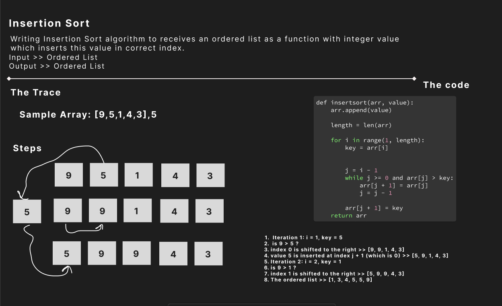

# Challenge Title

## **Code Challenge no.26: Insertion Sort**

### Whiteboard Process

### Approach & Efficiency

1. Start with the second element and iterate through the array.
2. Compare the current element with the elements on its left.
3. If a larger element is found, shift it one position to the right.
4. Repeat step 3 until the correct position for the current element is found.
5. Insert the current element into its correct position.
6. Repeat steps 2 to 5 for all elements in the array.
7. The array is now sorted in ascending order.

- Time complexity: O(n^2)
- Space complexity: O(n1)

### Solution

To run the code, you have to pass an array and a value to be inserted:

- Test code: `pytest tests/test_sort.py`
- Run  code: `python3 insertionsort/insertionsort.py`
