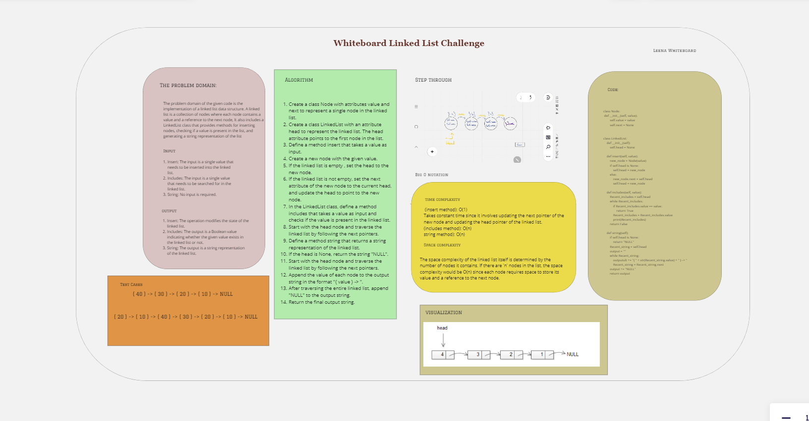

# Challenge_Class_05||  Linked List Implementation

Create a Node class that has properties for the value stored in the Node, and a pointer to the next Node, and create a LinkedList class also that provides three methodswhice the linked list class has a head node as the following methods defined:<br>

1. Insert
2. Includes
3. string<br>

- The `insert` method should add a new node to the linked list.
- The `includes` method should determine whether a given value exists within the linked list.
- The `string` method return a string represent all the values in the linked list.
Like : `{ a }` , `{ b }` , `{ c }`

## Whiteboard Process


## Approach & Efficiency

A linked list consists of two classes: the main LinkedList class that stores all the methods and a reference to the head of the list (the first thing in it). The other class is a Node that stores a data value and the reference to the next node.
## Big O 
1. The space complexity of a linked list is O(n), where n is the number of nodes in the list.

2. The Time complexity also O(n) since the worst case involves for each node in the list.

- O(1) : Insert element at the beginning.
- O(n) : add element at the end and at a specific position in the node.

## Solution
#  Create a Node class with properties the value stored in the Node, and a pointer to the next Node
``` 

class Node:
    def __init__(self, value):
        self.value = value
        self.next = None


class LinkedList:
    def __init__(self):
        self.head = None

    def insert(self, value):
        new_node = Node(value)
        if self.head is None:
            self.head = new_node
        else:
            new_node.next = self.head
            self.head = new_node

    def includes(self, value):
        Recent_includes = self.head
        while Recent_includes:
            if Recent_includes.value == value:
                return True
            Recent_includes = Recent_includes.value
            print(Recent_includes)
        return False

    def string(self):
        if self.head is None:
            return "NULL"
        Recent_string = self.head
        output = ""
        while Recent_string:
            outputult += "{ " + str(Recent_string.value) + " } -> "
            Recent_string = Recent_string.next
        output += "NULL"
        return output


if __name__ == "__main__":
    #  nodes
    node1 = Node('a')
    node2 = Node('b')
    node3 = Node('c')
    node4 = Node('d')

# Linked together
    node1.next = node2
    node2.next = node3
    node3.next = None
    node4.next = node1
    print(node1.value)
    print(node2.value)
    print(node3.value)

```
