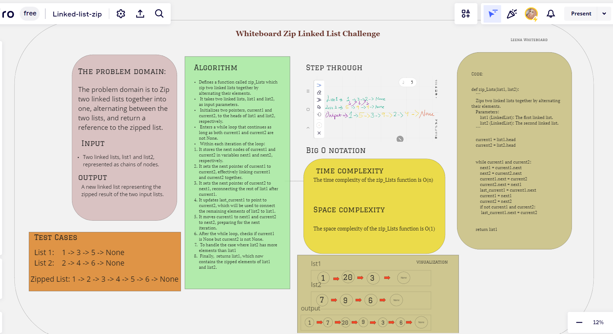

# Challenge Title: linked-list-zip

Zips two linked lists together by alternating their elements.

    Parameters:
        list1 (LinkedList): The first linked list.
        list2 (LinkedList): The second linked list.

    Returns:
        LinkedList: The modified first linked list (list1) with the elements of list2 zipped into it.

## Whiteboard Process

<br>

## Approach

The `zip_Lists` function follows the following approach to zip two linked lists together:

1. Initialize two pointers, `current1` and `current2`, to the heads of the input linked lists `list1` and `list2`, respectively.
2. Enter a while loop that continues as long as both `current1` and `current2` are not None.
3. Within each iteration of the loop:
   - Store the next nodes of `current1` and `current2` in variables `next1` and `next2`, respectively.
   - Update the `next` pointer of `current1` to point to `current2`, linking them together.
   - Update the `next` pointer of `current2` to point to `next1`, reconnecting the rest of `list1` after `current1`.
   - Update `last_current1` to point to `current2`.
   - Move `current1` to `next1` and `current2` to `next2`.
4. After the while loop, check if `current1` is None but `current2` is not None. If true, connect the remaining elements of `list2` to `list1` by setting the `next` pointer of `last_current1` to `current2`.
5. Return `list1`, which now contains the zipped elements.

## Efficiency

The efficiency of the `zip_Lists` function is as follows:

- Time Complexity: O(n), where n is the length of the longer linked list between `list1` and `list2`. The function iterates through the linked lists in a single while loop, processing each node once.
- Space Complexity: O(1). The function uses a fixed number of variables to track the current nodes and their next nodes. It does not require additional data structures or dynamic memory allocations.

Please note that the implementation assumes that both `list1` and `list2` are valid linked lists and have at least one node.

## Solution

<br><br>

Running use >> `python zipLinkedList/zipll.py`<br>
To testing >> `pytest tests/testZip.py`

[click here to see the code](./zipll.py)

  ```python

def zip_Lists(list1, list2):
    """
    Zips two linked lists together by alternating their elements.
    Parameters:
        list1 (LinkedList): The first linked list.
        list2 (LinkedList): The second linked list.
    """

    current1 = list1.head
    current2 = list2.head


    while current1 and current2:
        next1 = current1.next
        next2 = current2.next
        current1.next = current2
        current2.next = next1
        last_current1 = current1.next
        current1 = next1
        current2 = next2
        if not current1 and current2:
         last_current1.next = current2


    return list1

    ```