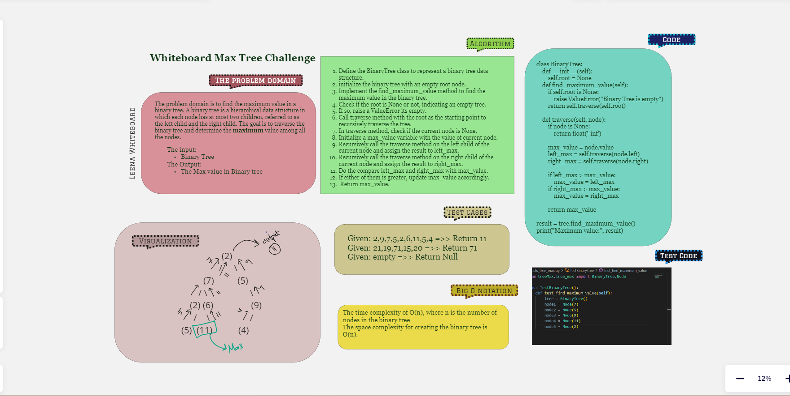

# Challenge Title || Binary Tree Maximum

- Find the Maximum Value in a Binary Tree Write the following method for the Binary Tree class find maximum value
Returns: number

## Whiteboard Process



## Approach and Efficiency

The Efficiency:
the big o for this approach will be :

The time complexity of this algorithm is O(n).
The space complexity of this algorithm is also O(n).

## Solution

### Examples of it in action --> <br>

 ```python

class BinaryTree:
    def __init__(self):
        self.root = None

    def find_maximum_value(self):
        if self.root is None:
            raise ValueError("Binary Tree is empty")
        return self.traverse(self.root)

    def traverse(self, node):
        if node is None:
            return float('-inf')
        
        max_value = node.value
        left_max = self.traverse(node.left)
        right_max = self.traverse(node.right)

        if left_max > max_value:
            max_value = left_max
        if right_max > max_value:
            max_value = right_max

        return max_value

result = tree.find_maximum_value()
print("Maximum value:", result)


```

### To Run and Test the code
> `python3 -m venv .venv`<br>
> `source .venv/bin/activate`<br>
> `pytest tests/tests_tree_max.py`<br>
> `python3 treeMax/tree_max.py`<br>
[Max_tree_code](./tree_max.py)<br>
[Max_tree_test](../tests/tests_tree_max.py)